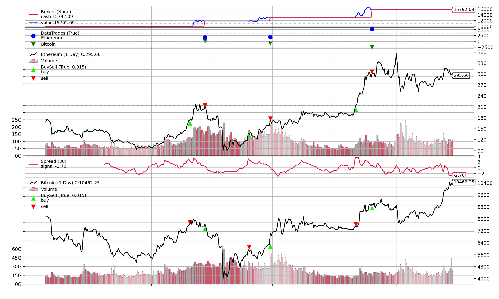

# CryptoPairTrading
Backtesting a strategy to pair trade BTC and ETH on a daily timeframe

## Initial Analysis

BTC returns and ETH returns have a correlation of 0.86 between 2019-09-18 and 2020-10-31 (training data)

## Training - Results

Period: 2019-09-18 and 2020-10-31

For more details checkout the "Training Pyfolio Analysis.ipynb" notebook

|  |  |
|---|---|
Threshold |  3.0 std 
Period | 30.0
Sell Threshold | 0.6
Starting Value | £10000.00
Ending   Value | £15792.09
Return | 58%
Annual Return | 32.9%

## Testing - Results

Period: 2020-11-01 to 2021-02-08

For more details checkout the "Testing Pyfolio Analysis.ipynb" notebook

|  |  |
|---|---|
Threshold |  3.0 std 
Period | 30.0
Sell Threshold | 0.6
Starting Value | £10000.00
Ending   Value | £12476.23
Return | 25%
Annual Return | 75.6%

